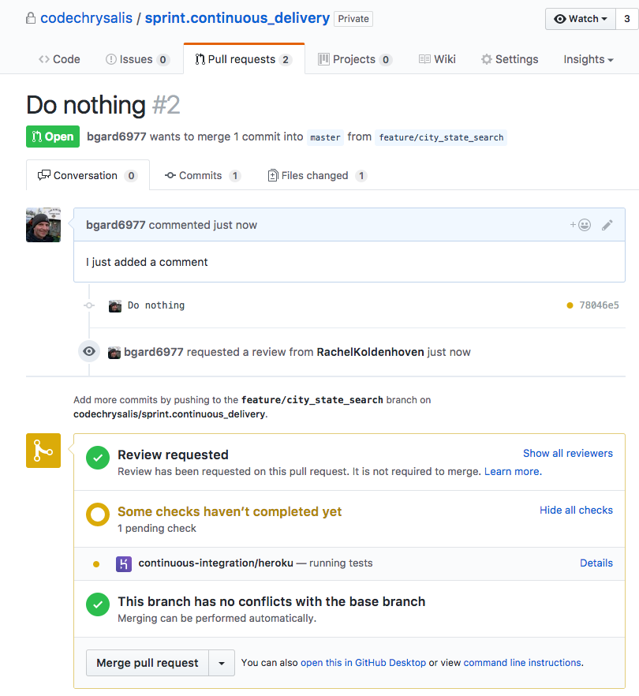
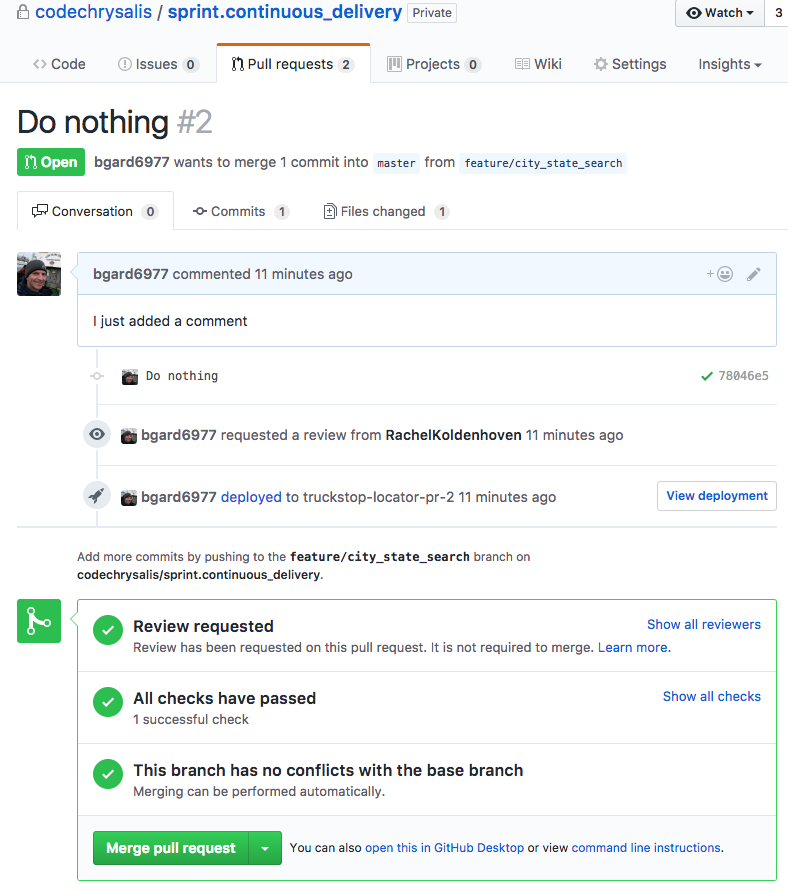
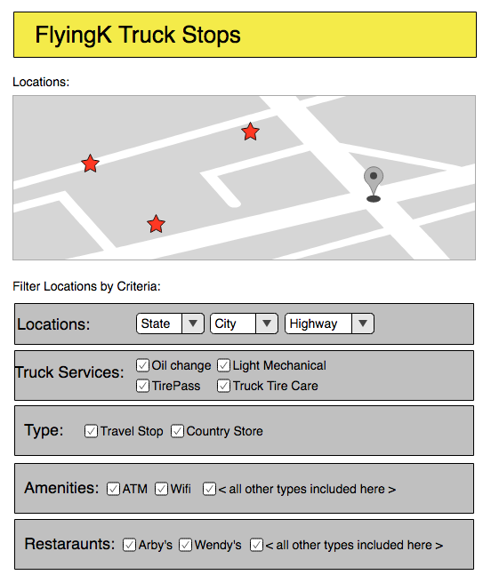
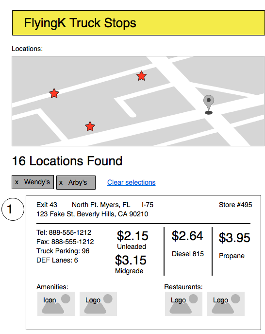

# Continuous Delivery Sprint

## Background

You have been hired by a truck stop company to create a single-page app so that travellers can search for truck stops based on a number of criteria.

## Objectives

- Gain experience working in a real agile workflow on a realistic CD pipeline
- Reinforce learnings on Vue
- Practice testing Vue
- Create a README.md so other developers can contribute to your project
- Create a 10 minute Presentation about your App, it needs to include:
  - Intro to your app
  - Tech used
  - Challenges faced
  - What you learned
  - How you approached developing the app
  - A Demo of your app

## CD Pipeline

Before you do any work on this project, first meet as a group to set up your CD pipeline. One person should share their screen on the projector, and walk through pipeline setup in Heroku. It is only after the pipeline is set up, tests pass, and the Product Manager can see "hello world" that a project begins.

Today we will be using Heroku as both our hosting provider and and our continuous integration pipeline. We will use Heroku because they have a unique feature set that makes this demonstration project possible in a classroom situation:

Heroku is considered a Platform as a Service (PaaS), rather than and Infrastructure as a Service (IaaS) like AWS, which is great but too complicated to set up for simple projects like ours.

Heroku allows us to set up a [CI/CD Pipeline](https://devcenter.heroku.com/articles/pipelines):

All work happens on feature branches. Once the work is ready, the developer creates a PR, which Heroku detects, and creates an environment for that branch and runs the tests:

The PM can log into the environment and verify functionality. If they like what they see, they can click a button to move the feature into production:

The final advantage of using Heroku is it's [fantastic docs](https://devcenter.heroku.com/categories/features). If you have any questions about the process, read them first!

## Testing

For this project, you are expected to write tests for everything! Fortunately, Vue's cli makes testing components easy!

## Mockups

The app consists of two screens:

1 - a search page with a map and several types of search criteria:

2 - a results page with the same map, but with locations filtered by the search criteria:

**_Remember, in an agile development shop, *mockups are not requirements*. The acceptance criteria are the only requirements, the mockups are merely supporting documentation to convey the idea more clearly._**

## Stories & Acceptance Criteria

As a software developer at an agile shop, you will likely be working on user stories pulled from an ordered backlog. You should follow a proccess that will become second nature to you:

1.  Grab the story at the top of the backlog and move it to "in progress"
1.  Create a feature branch
1.  Write tests first
1.  Write code to make the tests pass
1.  Push your branch
1.  Create a pull request
1.  Verify your build passes in heroku
1.  Notify the Product Manager to review your PR
1.  Move your story to "delivered"
1.  Play some ping pong
1.  Pull the next story and repeat the process

If the PM (your instructor) accepts your story, they will click the "merge" button in Github, and your feature will be automatically deployed to staging or production. (The story is "accepted" and "deployed".)

### Backlog

The following stories and acceptance criteria are written to be as realistic as possible, and define the building of an app that locates truck stops. Try to parallelize work as much as possible. If you see stories that can be re-arranged to increase productivity, contact your PM and ask if they can be re-ordered. If you see stories that can be broken up or modified to deliver faster or decrease risk, contact your PM.

Note there are no Chores. Stories all have user facing business value, and are described in functional terms to achieve that value. Implementation is left to the developer. You can create chores if you need to accomplish purely technical tasks, and you can work on them in parallel if you need to.

**_Have an Iteration Planning Meeting (IPM) before you start the iteration to groom this backlog, and accept or reject stories, point them, and create Tasks and Chores as needed_**

- As a traveler, I would like to see a map of all FlyingK locations, so that I can plan my trip.
  - Given that I visit the home page, then I see a map with markers for each store location
  - Given that I see the map, when I click and drag, then the map moves
  - Given that I see the map, when I click "zoom in", then the map should zoom
  - When I look at the map, then I see different icons based on store type (Travel Stop vs Country Store)
- As a traveler, I would like to be able to filter based upon State, City, and Highway, so that I can find stores quickly
  - Given that there is a state dropdown, when I select a state and click "search", then all locations not in that state are removed from the map.
  - Given that I have selected a state, then I expect to see a list of cities in that state appear in the city dropdown.
  - Given that I have selected a city and state, when I click "search" I expect to see all locations not in that city disappear from the map.
  - Given that I have selected a city and state, then I expect to see the highway dropdown populated with a list of highways relevant to that city and state in the highway dropdown.
  - Given that I select a highway, then I expect to see all other locations disappear from the map.
- As a traveler, I would like to be able to filter based upon location type: Travel Stop or Country Store, so that I can find the types I want.
  - Given that I check travel stop but not country store, when click search, I expect to see only travel stops.
  - Given that I check country store but not travel stop, when I click search, I expect to see only country stores.
  - Given that I check both, when I click search, I expect to see all locations.
  - Given that I check neither, when I click search, I expect to see all locations.
- As a trucker, I would like to filter locations based on truck services, so that I know which location to visit.
  - Given that I am on the home page, I should see check boxes for each truck service: Commerical Truck Oil Change, Light Mechanical, and Truck Tire Care
  - Given that I select a truck service, when I click search, I expect locations to be filtered by that service on the map
- As a traveler I would like to be able to filter based on Amenities, so that I can choose which location to visit.
  - Given that I am on the home page, I should see check boxes for each amenity.
  - Given that I select some amenities, when I click search, I expect to see the locations on the map filtered by my selections.
- As a hungry traveler, I would like to filter by restaurants, so that I can plan my calorie intake.
  - Given that I am on the home page, then I should see a list of checkboxes for restaurants.
  - Given that I select some restaurants, when I click search, I expect to see the locations on the map get filtered.
- As a traveler, I would like to see a list of locations after I search, so that I can easily scroll for information
  - Given that I select some criteria, when I click search, then a list of locations should replace the search check boxes
  - Given that a list of locations is visible, then I expect it to contain: Highway exit number and freeway number, street address, telephone, fax, and store number
- As a traveler, I would like to see gas prices, so that I know where to shop
  - Given that I have performed a search and I see the store list, then I also expect to see types and prices of fuel
- As a traveler, I would like to see a list of amenities, so that I can plan my trip
  - Given that I have performed a search and see the restaurant list, I would like to see a list of amenities at each location.
- As a traveler, I would like to see a list of restaurants, so that I can plan my diet
  - Given that I have performed a search and see the restaurant list, I would like to see a list of restaurants at each location.
- As a franchise owner, I would like travelers to see my logo, so that I have brand recognition
  - Given that a user has performed a search, when they see a list of restaurants, I would like my logo to appear instead of the restaurant name

## Advanced requirements

- As a user, I would like the map to center on my selected locations, so that I don't have to zoom manually.
  - Given that I am on the home page, and I have made some selections, when I click search, I expect the locations to be filtered, and the map [letterbox](<https://en.wikipedia.org/wiki/Letterboxing_(filming)>) on the bounds of the visible locations.
- As a user, I would like a tooltip to appear when I hover over map markers
  - When I hover over a map marker, then I see a tooltip with the following info: store number, address, and telephone number.
- As a traveler, I would like the site to be visually appealing, so that I don't puke
  - Given that I see the location list, when I look at the amenities, then I would like to see icons instead of words.
- As a super bad-ass trucker, when I hit "search", I want to hear the song [Voodoo Trucker](https://www.youtube.com/watch?v=QmskQLLDlNk) play in it's entirety.
